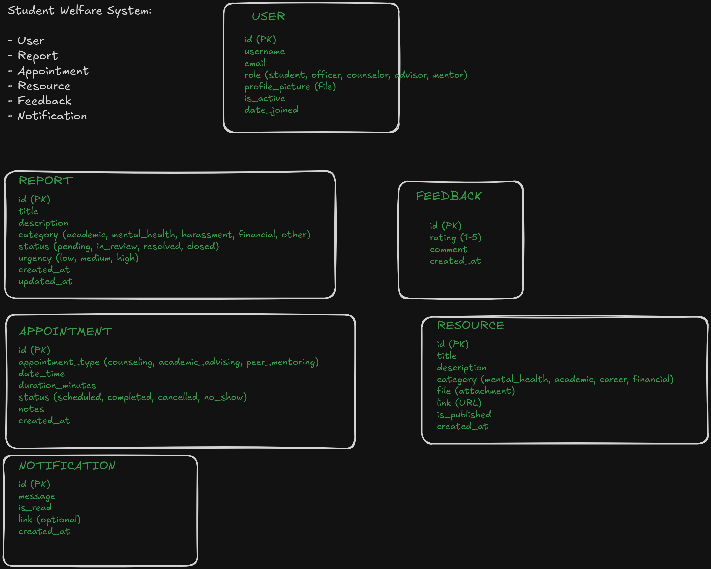
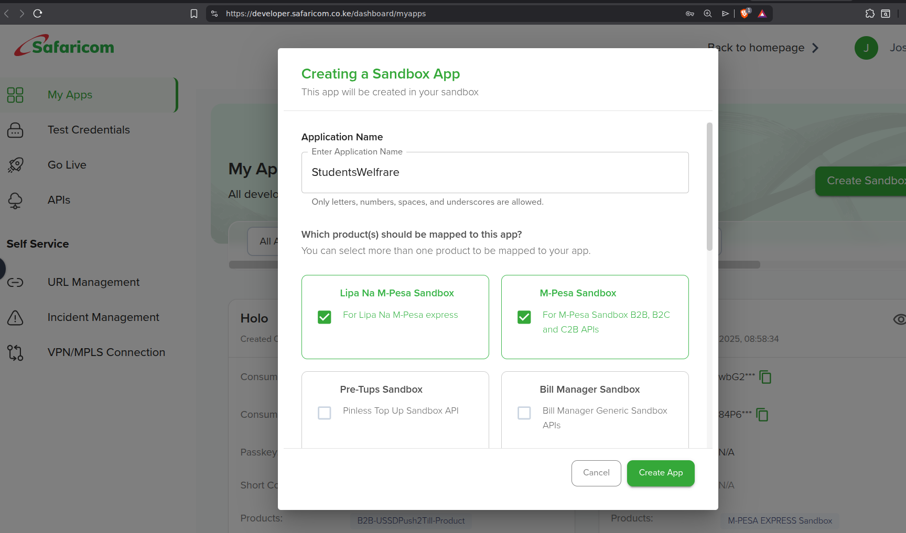
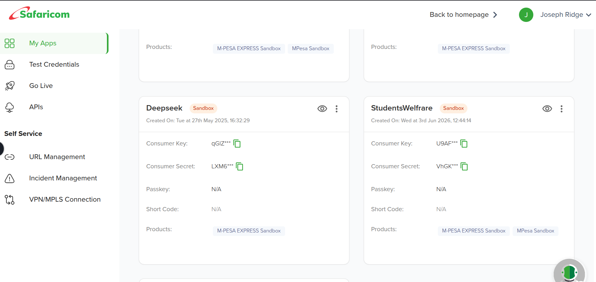
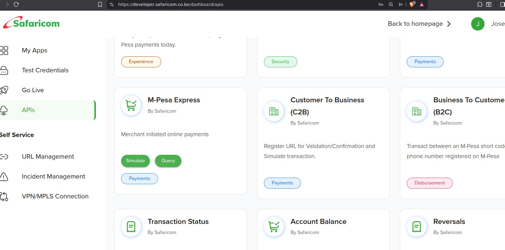
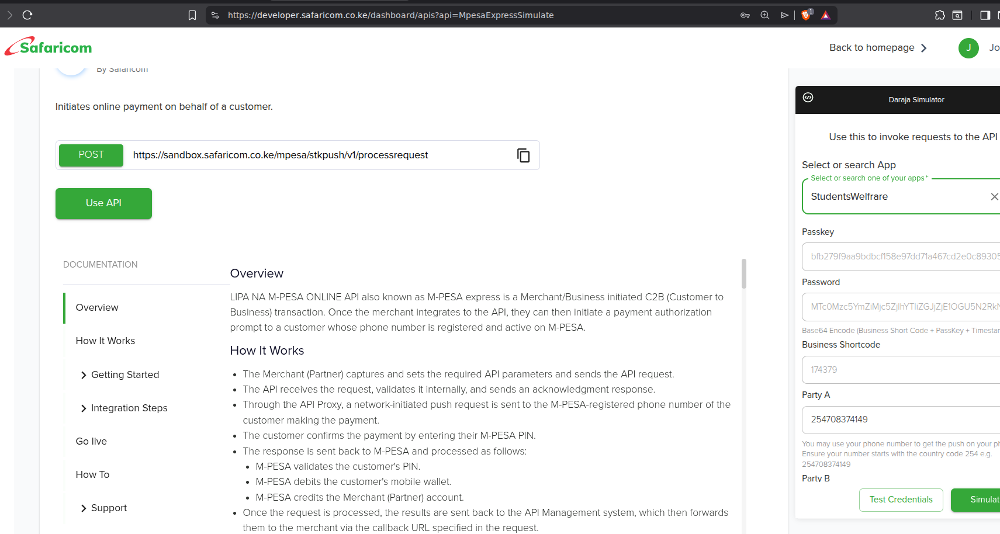
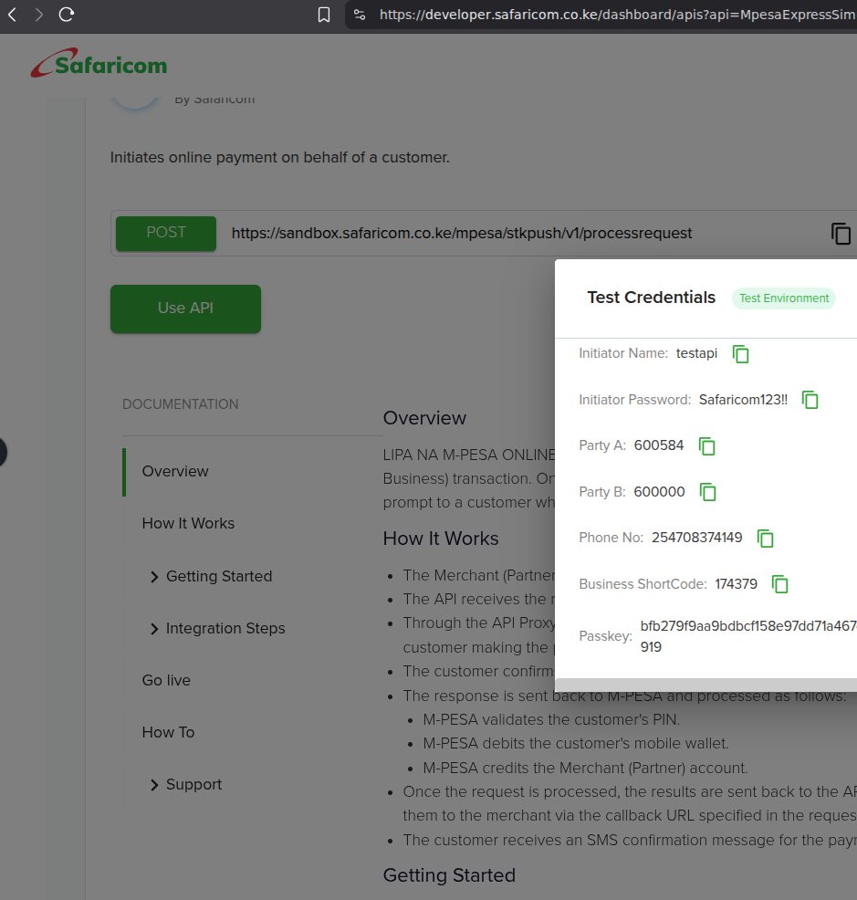
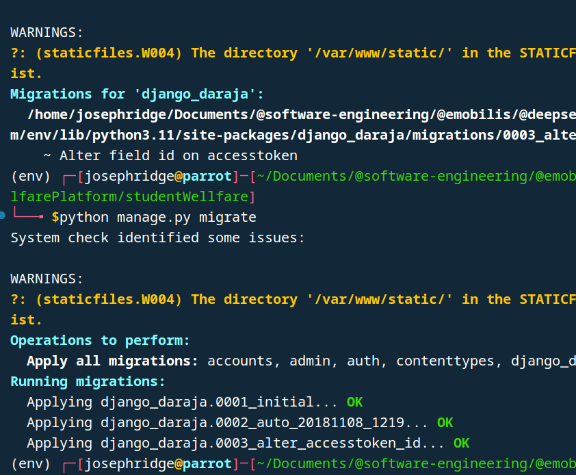

## set-up 

- to attain the needed libraries run `pip install -r requirements.txt`
- configure templates, static and media (all this will be done in `setting.py`):
    - Templates (add ` 'DIRS': [BASE_DIR / 'templates'],` inside the TEMPLATES config): 
    ```
            TEMPLATES = [
            {
                'BACKEND': 'django.template.backends.django.DjangoTemplates',
                'DIRS': [BASE_DIR / 'templates'],
                'APP_DIRS': True,
                'OPTIONS': {
                    'context_processors': [
                        'django.template.context_processors.request',
                        'django.contrib.auth.context_processors.auth',
                        'django.contrib.messages.context_processors.messages',
                    ],
                },
            },
        ]
    ```

    - static & media  config: 
        ```
        STATIC_URL = 'static/'
        STATICFILES_DIRS = [
            BASE_DIR / "static",
            "/var/www/static/",
        ]

        MEDIA_URL = '/media/'
        MEDIA_ROOT = BASE_DIR / 'media'
        ```
    
    - update `urls.py` (project level):

        ```
            from django.contrib import admin
            from django.urls import path
            from django.conf import settings 
            from django.conf.urls.static import static


            urlpatterns = [
                path('admin/', admin.site.urls),
            ]
            if settings.DEBUG:
                urlpatterns += static(settings.MEDIA_URL, document_root=settings.MEDIA_ROOT)
        ``` 

TODO: Add each step of implementation


## Auth Set-up

- add this in your `setting.py`:  `AUTH_USER_MODEL = 'accounts.User'`

- Create `user-model`:
    - We bring in the abstractuser since we want to customize the user details
    ``` {py}

        from django.db import models
        from django.contrib.auth.models import AbstractUser # helps in customization of User themselves

        # Create your models here.

        class User(AbstractUser):

            ROLE_CHOICES ={
                "student": "Student", 
                "officer":"Welfare Officer", 
                "counsellor": "Counsellor",
                "lecturer":"Lecturer"
            }

            roles = models.CharField(max_length=100, choices=ROLE_CHOICES, default="student")
            bio = models.TextField(blank = True)
            profile_picture = models.ImageField(upload_to="profile_pictures", blank=True) 

    ```

- create the userForm: 
    - create the `forms.py` file
    - create the `UserForm`: 
        ```
        from django.contrib.auth.forms import UserCreationForm  # embracing the prebuilt UserCreationForm
        from .models import User # importing the Model

        class UserForm(UserCreationForm):
            class Meta: 
                model = User 
                fields = UserCreationForm.Meta.Fields + ("first_name", "last_name","email", "roles","profile_picture","bio")

        ```


# Database Structure:



# Mpesa Integration: 

- Create account on [Daraja ](https://developer.safaricom.co.ke/)
- Create a sandbox application  [my apps](https://developer.safaricom.co.ke/dashboard/myapps):


- Once created:


- Install [django-daraja](https://pypi.org/project/django-daraja/) using `pip install django-daraja` 

- Start off with the [documentation](https://django-daraja.readthedocs.io/en/latest/):
    - set up on django navigate to `settings.py`:
    ```
        # The Mpesa environment to use
        # Possible values: sandbox, production

        MPESA_ENVIRONMENT = 'sandbox'

        # Credentials for the daraja app

        MPESA_CONSUMER_KEY = 'mpesa_consumer_key'
        MPESA_CONSUMER_SECRET = 'mpesa_consumer_secret'

        #Shortcode to use for transactions. For sandbox  use the Shortcode 1 provided on test credentials page

        MPESA_SHORTCODE = 'mpesa_shortcode'

        # Shortcode to use for Lipa na MPESA Online (MPESA Express) transactions
        # This is only used on sandbox, do not set this variable in production
        # For sandbox use the Lipa na MPESA Online Shorcode provided on test credentials page

        MPESA_EXPRESS_SHORTCODE = 'mpesa_express_shortcode'

        # Type of shortcode
        # Possible values:
        # - paybill (For Paybill)
        # - till_number (For Buy Goods Till Number)

        MPESA_SHORTCODE_TYPE = 'paybill'

        # Lipa na MPESA Online passkey
        # Sandbox passkey is available on test credentials page
        # Production passkey is sent via email once you go live

        MPESA_PASSKEY = 'mpesa_passkey'

        # Username for initiator (to be used in B2C, B2B, AccountBalance and TransactionStatusQuery Transactions)

        MPESA_INITIATOR_USERNAME = 'initiator_username'

        # Plaintext password for initiator (to be used in B2C, B2B, AccountBalance and TransactionStatusQuery Transactions)

        MPESA_INITIATOR_SECURITY_CREDENTIAL = 'initiator_security_credential'
    ```


`[Mpesa Express Simulation](https://developer.safaricom.co.ke/dashboard/apis?api=MpesaExpressSimulate)`


- select *test credentials*:


- Capture:
    - Business ShortCode
    - pass key


- run `python manage.py makemigrations` & `python manage.py migrate`:
